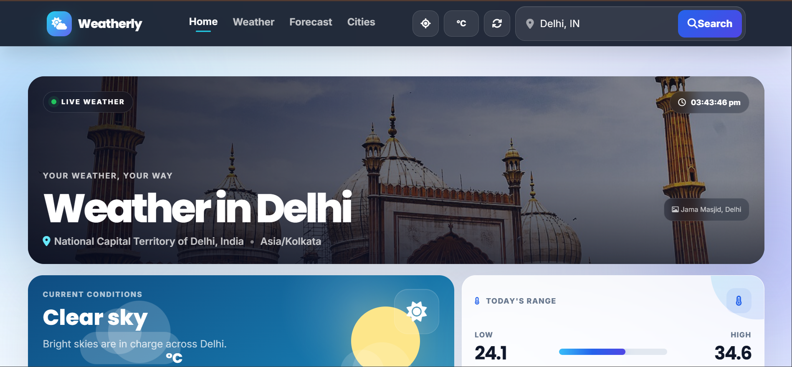
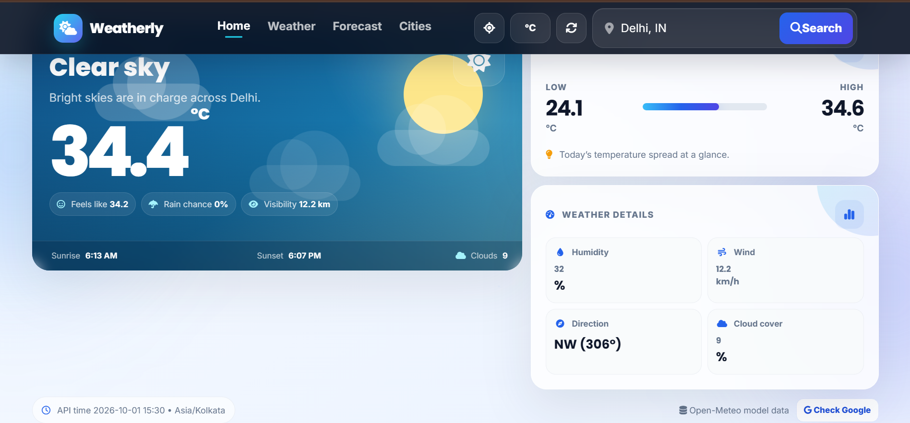
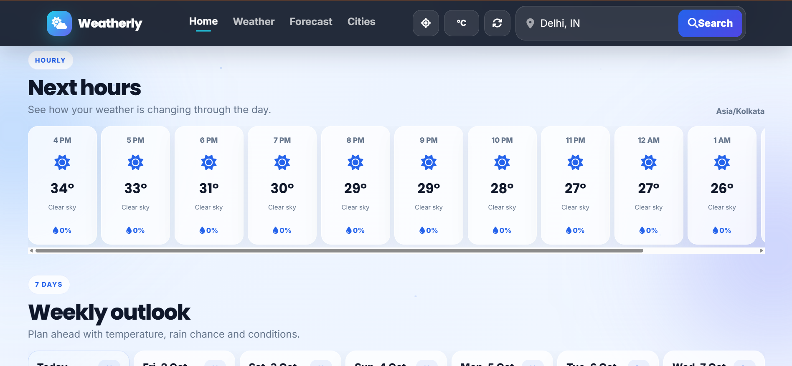
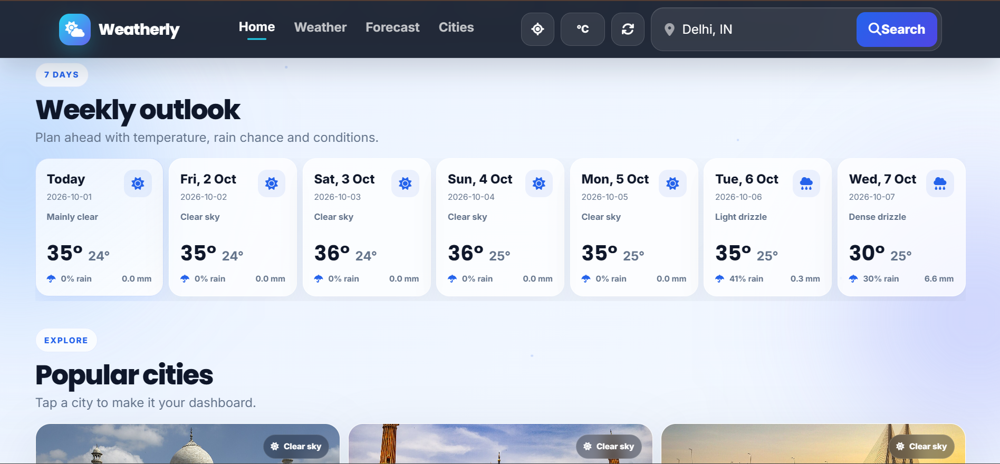
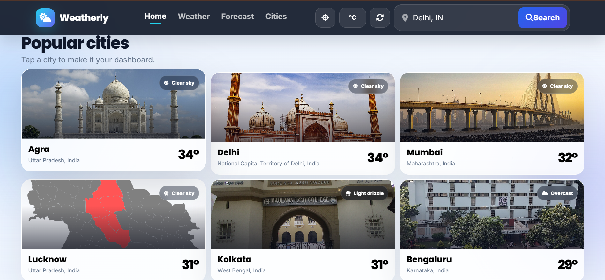

# 🌤️ Weatherly — Live Weather Dashboard

<p align="center">
  <strong>A modern, responsive weather dashboard built with HTML, CSS and JavaScript.</strong>
</p>

<p align="center">
  <a href="https://armankhan-programmer.github.io/Weatherly/">
    🌐 Live Demo
  </a>
  &nbsp;•&nbsp;
  <a href="https://www.linkedin.com/in/armankhan7860/">
    💼 LinkedIn
  </a>
  &nbsp;•&nbsp;
  <a href="https://github.com/ArmanKhan-Programmer">
    💻 GitHub Profile
  </a>
</p>

<p align="center">
  
  
  
  
  
</p>

---

## 🚀 Live Demo

### 👉 [Open Weatherly](https://armankhan-programmer.github.io/Weatherly/)

Weatherly is deployed using **GitHub Pages**, so you can try the dashboard directly in your browser.

---

## 📌 About the Project

**Weatherly** is a frontend weather dashboard designed to make weather information easy to scan while still providing detailed forecasts.

The dashboard combines:

- Current weather conditions
- Today's temperature range
- Weather details such as humidity, wind and cloud cover
- Hourly forecasts
- 7-day forecasts
- Searchable cities
- Browser-based location detection
- Dynamic city/landmark photography
- Popular city weather cards
- Celsius/Fahrenheit and km/h/mph unit switching
- A Google weather verification shortcut

The interface uses a compact, information-dense layout so important weather data stays visible without large empty areas.

> **Weather data note:** Weatherly uses **Open-Meteo** for its weather data. Values can differ from Google's weather panel because different weather providers can use different models, locations, observation sources and update times.

---

## ✨ Key Features

### 🌡️ Current Weather
- Current temperature
- Feels-like temperature
- Current weather condition
- Rain probability
- Visibility
- Humidity
- Wind speed
- Wind direction
- Cloud cover
- Sunrise and sunset
- Local time for the selected location

### 🕒 Forecasts
- Hourly forecast with temperature and precipitation probability
- 7-day forecast
- Daily minimum and maximum temperatures
- Daily precipitation information
- Weather condition icons

### 🏙️ City Search & Location
- Search for cities around the world
- Open-Meteo geocoding
- Browser geolocation support
- Popular city shortcuts
- Dynamic city/landmark images

### 🎨 UI & UX
- Modern glassmorphism-inspired cards
- Gradient backgrounds
- Dynamic weather visuals
- Day/night-aware presentation
- Responsive layout
- Compact information cards
- Hover interactions
- Mobile-friendly structure
- Accessible labels
- Reduced-motion support

### ⚙️ Controls
- Celsius ↔ Fahrenheit
- km/h ↔ mph
- Refresh weather data
- Use current location
- Quick Google weather verification

---

## 🖥️ Interface Preview

### 🏠 Weather Dashboard



The main dashboard presents the selected city's photo, local time, current condition and a quick overview of the weather.

### 🌡️ Current Weather & Details



The current-weather section shows temperature, feels-like temperature, rain chance, visibility, sunrise/sunset, humidity, wind and cloud cover.

### 🕒 Hourly Forecast



The hourly section provides a scrollable view of upcoming temperatures, weather conditions and rain probability.

### 📅 7-Day Forecast



The weekly outlook displays daily conditions, high/low temperatures and precipitation information.

### 🏙️ Popular Cities



Popular cities are presented as visual cards with city photography, current conditions and temperatures.

> **Screenshot setup:** The screenshots above are included in the `assets/` folder of this README package. Upload that folder to your repository alongside `README.md`.

---

## 🧰 Tech Stack

| Technology | Purpose |
|---|---|
| **HTML5** | Application structure |
| **CSS3** | Styling, responsive layout and visual effects |
| **JavaScript ES6+** | Weather logic, API calls and UI interactions |
| **Bootstrap 5** | Responsive utilities/components |
| **Font Awesome** | Icons |
| **Google Fonts** | Typography |
| **Open-Meteo Geocoding API** | City/location search |
| **Open-Meteo Forecast API** | Weather and forecast data |
| **Wikipedia / MediaWiki API** | City and landmark photography |
| **Browser Geolocation API** | Location-based weather |
| **LocalStorage** | Persisting unit preference |

---

## 📡 APIs & Data Sources

### Open-Meteo

Weatherly uses Open-Meteo for location search and weather data.

- **Geocoding API:** `https://geocoding-api.open-meteo.com/`
- **Forecast API:** `https://api.open-meteo.com/`
- **Documentation:** https://open-meteo.com/en/docs

The application uses weather information such as:

- Temperature
- Apparent/feels-like temperature
- Humidity
- Precipitation
- Weather codes
- Wind speed/direction
- Visibility
- Sunrise/sunset
- Hourly forecast
- Daily forecast

### Wikipedia / MediaWiki

City and landmark images are retrieved dynamically through the MediaWiki API when an appropriate image is available.

- **Documentation:** https://www.mediawiki.org/wiki/API:Main_page

---

## 🔄 How Weatherly Works

```text
User searches for a city
        ↓
Open-Meteo Geocoding API
        ↓
Latitude + Longitude
        ↓
Open-Meteo Forecast API
        ↓
Current + Hourly + Daily Weather
        ↓
JavaScript processes the response
        ↓
Weatherly updates the dashboard
```

For city visuals, Weatherly separately searches for an appropriate city/landmark image and displays it in the interface.

---

## 📁 Project Structure

```text
Weatherly/
│
├── index.html          # Main application structure
├── style.css           # UI, responsive design and visual effects
├── script.js           # API calls, weather logic and interactions
├── README.md           # Project documentation
│
└── assets/             # README screenshots
    ├── dashboard-hero.png
    ├── current-weather.png
    ├── hourly-forecast.png
    ├── weekly-forecast.png
    └── popular-cities.png
```

---

## 🚀 Run Locally

Weatherly is a static frontend project and does not require a backend server.

### 1. Clone the repository

```bash
git clone https://github.com/ArmanKhan-Programmer/Weatherly.git
```

### 2. Open the project

```bash
cd Weatherly
```

### 3. Run the application

You can open:

```text
index.html
```

For the best development experience, use **VS Code Live Server**.

### Using Live Server

1. Open the project in VS Code.
2. Install the Live Server extension.
3. Right-click `index.html`.
4. Select **Open with Live Server**.

---

## 🎯 How to Use

### Search for a city

Enter a city such as:

```text
Delhi, India
```

or:

```text
London, UK
```

Weatherly geocodes the location and loads its available weather data.

### Use your location

Click the location button in the navigation bar and allow browser location access.

> Browser geolocation requires user permission and generally works best over HTTPS or a secure local development environment.

### Change units

Use the unit control to switch between:

```text
°C ↔ °F
km/h ↔ mph
```

The selected unit preference is stored locally using `LocalStorage`.

### Refresh

Use the refresh button to request fresh weather data.

### Check Google

The **Check Google** button opens a Google weather search for the selected city so you can compare the displayed Open-Meteo values with Google's result.

---

## ⚠️ Weather Data Accuracy

Weatherly is a frontend application that consumes data from **Open-Meteo**.

It should not be expected to reproduce Google's weather values exactly.

Differences can occur because weather services may use different:

- Weather models
- Observation stations
- Update times
- Geographic coordinates
- Interpolation methods
- Forecast providers

For transparency, the dashboard identifies its source as:

```text
Open-Meteo model data
```

This makes it clear which provider supplies the displayed weather values.

---

## 🔐 Privacy

Weatherly does not require:

- An account
- A login
- A database
- A personal profile

Browser location is only requested when the user chooses the location feature and grants permission.

The unit preference is stored locally in the browser.

---

## 🌐 Deployment

Weatherly is currently deployed on **GitHub Pages**:

**Live:** https://armankhan-programmer.github.io/Weatherly/

The project can also be hosted on other static hosting platforms such as:

- GitHub Pages
- Netlify
- Vercel
- Cloudflare Pages

---

## 🧠 What This Project Demonstrates

This project demonstrates practical frontend development skills including:

- DOM manipulation
- JavaScript event handling
- Asynchronous programming with `fetch()`
- REST API integration
- JSON data handling
- Geocoding
- Browser Geolocation API
- Dynamic UI rendering
- Responsive CSS
- LocalStorage
- Error handling
- API-driven application design
- Working with third-party services
- Deploying a static web application

---

## 🔮 Future Improvements

Planned or possible improvements include:

- [ ] Weather alerts
- [ ] Air-quality information
- [ ] UV index
- [ ] Pollen information
- [ ] More detailed precipitation charts
- [ ] Favorite cities
- [ ] Recent searches
- [ ] Weather radar integration
- [ ] Automatic background refresh
- [ ] PWA/offline support
- [ ] Improved image attribution and fallback handling
- [ ] More detailed weather statistics

---

## 👨‍💻 Author

### Arman Khan

Computer Science Engineering Student

**Interests:**

- Java
- Backend Development
- Web Development
- AI / ML

### Connect With Me

💼 **LinkedIn:**
https://www.linkedin.com/in/armankhan7860/

💻 **GitHub:**
https://github.com/ArmanKhan-Programmer

---

## 📄 License

This project is intended for educational and personal portfolio use.

If you reuse or modify the project, keep the relevant third-party API attribution and documentation links.

---

<p align="center">
  ⭐ If you found Weatherly useful, consider starring the repository!
</p>
